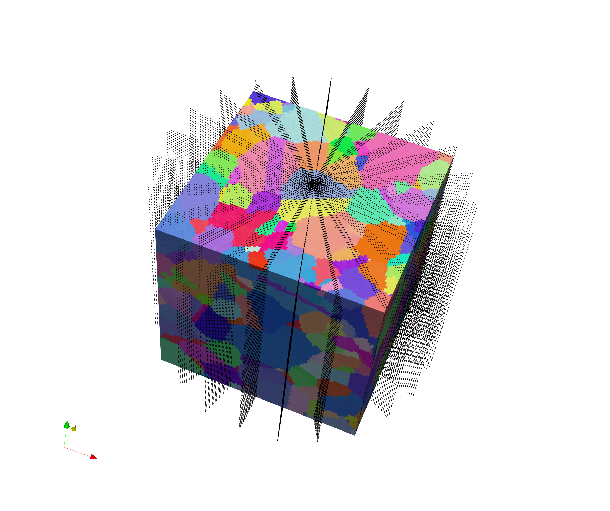

# Generate Tilt Series #

## Group (Subgroup) ##

Core Filters (SIMPLib)

## Description ##

This **Filter** creates a series of slices through the Image Geometry where each slice is rotated around the axis selected by the user.

Each Slice is saved as a new DataContainer with a Cell Attribute Matrix. The user will select which Cell Level Data Array to resample using a simple nearest neighbor algorithm. The filter will only rotation from Zero to **less than** 180 Degrees.

## Parameters ##

| Name | Type | Description |
|------|------|------|
| Rotation Axis | Int | 0=<100>, 1=<010>, 2=<001> |
| Rotation Increment | Float | The number of degrees of rotation between each slice |
| Resample Spacing | Float Vec 3 | The Spacing in the X, Y, Z direction for the resampling |
| Input Data Array Path | DataArrayPath | The path to the Cell level data array to resample |

## Required Geometry ##

Required Geometry Type: Image Geometry

## Required Objects ##

| Kind | Default Name | Type | Component Dimensions | Description |
|------|--------------|-------------|---------|-----|

## Created Objects ##

| Kind | Default Name | Type | Component Dimensions | Description |
|------|--------------|------|----------------------|-------------|
| **Data Container** | Name suffixed with the rotation index | DataContainer | N/A | A new DataContainer for each rotation is created |

## Example Pipelines ##

List the names of the example pipelines where this filter is used.

## License & Copyright ##

Please see the description file distributed with this plugin.

## DREAM3D Mailing Lists ##

If you need more help with a filter, please consider asking your question on the DREAM3D Users mailing list:
https://groups.google.com/forum/?hl=en#!forum/dream3d-users