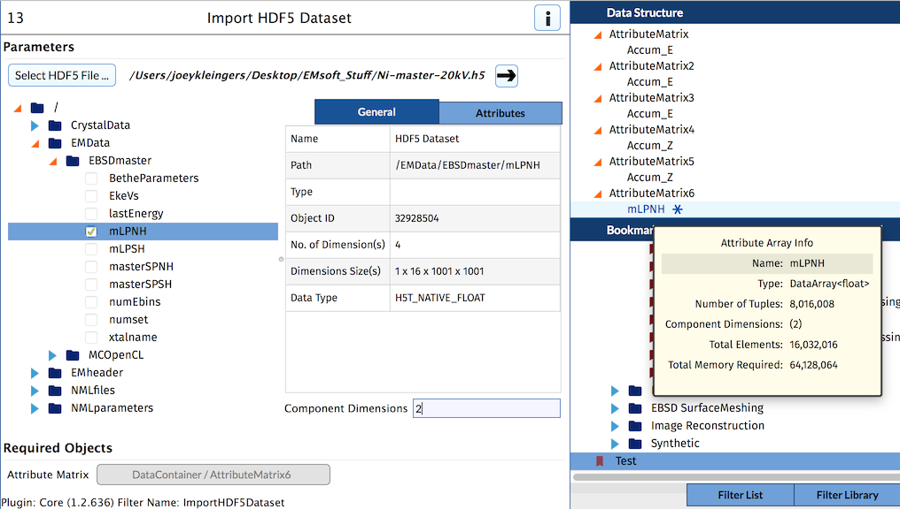

Import HDF5 Dataset {#importhdf5dataset}
=============

## Group (Subgroup) ##

Core (IO/Read)

## Description ##

This **Filter** allows the user to import a dataset from an HDF5 file and store it as an attribute array in DREAM.3D.  This filter supports importing datasets with any number of dimensions, as long as the component dimensions parameter and the tuple dimensions of the destination attribute matrix work with the dataset dimensions to satisfy this equation:

(Product of Dataset Dimensions) / (Product of Component Dimensions) = (Destination Attribute Matrix Tuple Dimensions)

The component dimensions are input as a comma-delimited list of dimensional values.  For example:
1. 3, 4 = 3x4
2. 5, 2, 1 = 5x2x1
3. 6 = 6

### Examples ###    
1. Suppose we have a 1D dataset in an HDF5 file with dimension **12,000**.
	We can input component dimensions of **5, 2, 2** and set the destination attribute matrix tuple dimensions to **35 x 5 x 2 x 2**
    
    Using the equation:
    (12,000) / (5 x 2 x 2) = (35 x 5 x 2 x 2)
    12,000 / 20 = 700
    600 = 700
    
    We have NOT satisfied the equation, so this will cause preflight errors.
    
1. Suppose we have a 3D dataset in an HDF5 file with dimensions **1 x 12 x 201 x 201**.  That is 484,812 total elements in the dataset.

	We can input component dimensions of **9, 6** and set our destination attribute matrix tuple dimensions to **134 x 67**.

	This will import correctly, because:
	(1 x 12 x 201 x 201) / (9 x 6) = (134 x 67)
	484,812 / 54 = 8,978
	8,978 = 8,978

	We have satisfied the equation, so we can import this dataset without errors (see below).

## Parameters ##

| Name | Type | Description |
|------|------| ----------- |
| HDF5 File | QString | The path to the HDF5 file |
| Dataset Path | QString | The HDF5 path to the dataset to import |
| Component Dimensions | QString | The component dimensions that the imported data will have.  This is a comma-delimited list of dimensional values |

## Required Geometry ##

Not Applicable

## Required Objects ##

| Kind | Default Name | Type | Component Dimensions | Description |
|------|--------------|------|----------------------|-------------|
| **Attribute Matrix**  | None         | DataArrayPath | N/A | **Attribute Matrix** used to store imported data |

## Created Objects ##

| Kind | Default Name | Type | Component Dimensions | Description |
|------|--------------|------|----------------------|-------------|
| **Attribute Array** | Name of dataset from HDF5 file | Type from HDF5 file | Input as a filter parameter | The created Attribute Array |

## Example Pipelines ##

## License & Copyright ##

Please see the description file distributed with this **Plugin**

## DREAM.3D Mailing Lists ##

