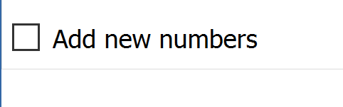
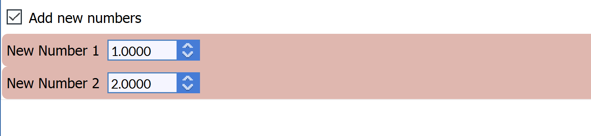

# LinkedBooleanFilterParameter

## Description

The **LinkedBooleanFilterParameter** gives the user a binary choice. If chosen, additional filter parameters are shown to the user.


## Python Code Parts

In init:
```(lang-python)
self.linked_bool: bool = False
```

Setter method:
```(lang-python)
def _set_linked_bool(self, value) -> None:
		self.linked_bool = value
```
Getter method:
```(lang-python)
def _get_linked_bool(self) -> bool:
		return self.linked_bool
```

In setup_parameters:
```(lang-python)
LinkedBooleanFilterParameter('Select for additional features', 'linked_bool', self.linked_bool, FilterParameter.Category.Parameter, self._set_linked_bool, self._get_linked_bool, ['param_1', 'param_2'], -1)
```

*'Select for additional features'* = label that shows up for user in DREAM3D

*linked_bool* = string value used to identify filter parameter in code

*self.linked_bool* = name of Boolean variable

*self._set_linked_bool* = setter method for Boolean variable

*self._get_linked_bool* = getter method for Boolean variable

*['param_1', 'param_2']* = list containing names of filter parameters to show when box is checked

## Example Code and GUI
```(lang-python)
LinkedBooleanFilterParameter('Add new numbers', 'linked_bool', self.linked_bool, FilterParameter.Category.Parameter, self._set_linked_bool, self._get_linked_bool, ['num_1', 'num_2'], -1)
```
*self.linked_bool = False*


*self.linked_bool = True*

