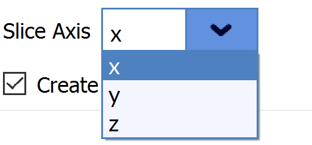

# ChoiceFilterParameter

## Description

The **ChoiceFilterParameter** allows the user to choose between a program-defined set of options. The options each get defined string labels and are accessed as integer values according to their order in the list.


## Python Code Parts

In init: `self.choice: int = 0`

Setter method:
```
def _set_choice(self, value: int) -> None:
		self.choice = value
```
Getter method:
```
def _get_choice(self) -> int:
		return self.choice
```

In setup_parameters: `ChoiceFilterParameter('Choices', 'choices', self.choice, FilterParameter.Category.Parameter, self._set_choice, self._get_choice, ["choice_1", "choice_2", "choice_3"], False, -1)`

*'Choices’* = label that shows up for user in DREAM3D

*‘choices’* = string value used to identify filter parameter in code

*self.choice* = name of int variable used to keep track of index of user choice

*self._set_choice* = setter method for int variable

*self._get_choice* = getter method for int variable

## Example Code and GUI
`ChoiceFilterParameter('Slice Axis', 'axes', self.axes, FilterParameter.Category.Parameter, self._set_axes, self._get_axes, ["x", "y", "z"], False, -1)`

