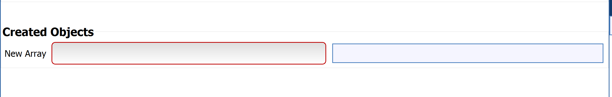

# DataArrayCreationFilterParameter

## Description

The **DataArrayCreationFilterParameter** allows the user to create a new DREAM3D data array. For the created array, the user will choose which DataContainer and AttributeMatrix to add the new array in and input the name of the new array.

## Requirement Type

```(lang-python)
DataArrayCreationFilterParameter.RequirementType()
```
**Properties**

*amTypes* = type of AttributeMatrix required for array

*dcGeometryTypes* = type of Geometry required for array


## Python Code Parts

In init:
```(lang-python)
self.created_data_array_path: DataArrayPath = DataArrayPath('', '', '')
```

Setter method:
```(lang-python)
def _set_created_data_array_path(self, value: DataArrayPath) -> None:
	 self.created_data_array_path = value
```
Getter method:
```(lang-python)
def _get_created_data_array_path(self) -> DataArrayPath:
    return self.created_data_array_path
```

In setup_parameters:
```(lang-python)
req = DataArrayCreationFilterParameter.RequirementType()
req.dcGeometryTypes = [IGeometry.Type.Image] #replace Image with type needed
req.amTypes = [AttributeMatrix.Type.Cell] #replace Cell with type needed
DataArrayCreationFilterParameter('New Array', 'new_array', self.created_data_array_path, FilterParameter.Category.CreatedArray, self._set_created_data_array_path, self._get_created_data_array_path, req, -1)
```

*'New Array’* = label that shows up for user in DREAM3D

*‘new_array’* = string value used to identify filter parameter in code

*self.created_data_array_path* = name of DataArrayPath variable used to keep track of path for array

*self._set_created_data_array_path* = setter method for DataArrayPath variable

*self._get_created_data_array_path* = getter method for DataArrayPath variable

## Example Code and GUI
```(lang-python)
 DataArrayCreationFilterParameter('New Array', 'new_array', self.new_arr, FilterParameter.Category.CreatedArray, self._set_new_arr, self._get_new_arr, DataArrayCreationFilterParameter.RequirementType(), -1)
```

