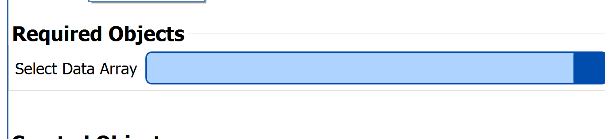

# DataArraySelectionFilterParameter

## Description

The **DataArraySelectionFilterParameter** allows the user to select a DREAM3D data array from either the file explorer or from the pipeline.

## Requirement Type

```(lang-python)
DataArraySelectionFilterParameter.RequirementType()
```
**Properties**

*amTypes* = type of AttributeMatrix required for array

*dcGeometryTypes* = type of Geometry required for array

*componentDimensions* = component dimensions required for the array

*daTypes* = data type(s) required for the array


## Python Code Parts

In init:
```(lang-python)
self.selected_data_array_path: DataArrayPath = DataArrayPath('', '', '')
```

Setter method:
```(lang-python)
def _set_selected_data_array_path(self, value: DataArrayPath) -> None:
    self.selected_data_array_path = value
```
Getter method:
```(lang-python)
def _get_selected_data_array_path(self) -> DataArrayPath:
    return self.selected_data_array_path
```

In setup_parameters:
```(lang-python)
req = DataArraySelectionFilterParameter.RequirementType()
req.dcGeometryTypes = [IGeometry.Type.Image] #replace Image with type needed
req.amTypes = [AttributeMatrix.Type.Cell] #replace Cell with type needed
req.daTypes = ["float", "double", "int32_t"] #replace dtype names with dtypes needed
req.componentDimensions = [VectorSizeT([1])] #replace 1 with dimensions needed
DataArraySelectionFilterParameter('Data Array', 'selected_data_array_path', self.selected_data_array_path, FilterParameter.Category.RequiredArray, self._set_selected_data_array_path, self._get_selected_data_array_path, req, -1)
```

*'Data Array’* = label that shows up for user in DREAM3D

*'selected_data_array_path’* = string value used to identify filter parameter in code

*self.selected_data_array_path* = name of DataArrayPath variable used to keep track of path for array

*self._set_selected_data_array_path* = setter method for DataArrayPath variable

*self._get_selected_data_array_path* = getter method for DataArrayPath variable

## Example Code and GUI
```(lang-python)
 DataArraySelectionFilterParameter('Input Data Array', 'selected_data_array_path', self.selected_data_array_path, FilterParameter.Category.RequiredArray, self._set_selected_data_array_path, self._get_selected_data_array_path, req, -1)
```

