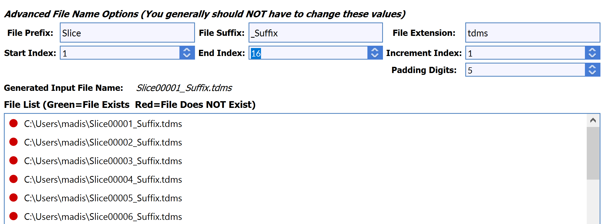

# FileListInfoFilterParameter

## Description

The **FileListInfoFilterParameter** allows the user to choose an input directory with a list of files. The user can then match file names and choose which files to use.

## Special Variables
```https://github.com/BlueQuartzSoftware/DREAM3D/blob/develop/Documentation/ReferenceManual/6_Developer/python_filter_development_prebuilt.md
StackFileListInfo(int, int, int, int, int, String, String, String, String)
```

Parameters in order: padding digits, ordering, start index, end index, increment index, input path, file prefix, file suffix, file extension (without ‘.’)


## Python Code Parts

In init:
```(lang-python)
self.stack_info_param: StackFileListInfo = StackFileListInfo(0, 0, 0, 0, 1, '', 'Prefix_', '_Suffix', 'file_extension')
```

Setter method:
```(lang-python)
def _set_new_string(self, value: str) -> None:
	self.new_string = value
```
Getter method:
```(lang-python)
def _get_new_string(self) -> str:
	return self.new_string
```

In setup_parameters:
```(lang-python)
FileListInfoFilterParameter('File List', 'file_list', self.stack_info_param, FilterParameter.Category.Parameter, self._set_stack_info_param, self._get_stack_info_param)
```

*'File List’* = label that shows up for user in DREAM3D

*‘file_list’* = string value used to identify filter parameter in code

*self.stack_info_param* = name of str variable used to keep track of user-inputted string

*self._set_stack_info_param* = setter method for str variable

*self._get_stack_info_param* = getter method for str variable

## Example Code and GUI
```(lang-python)
self.stack_info_param: StackFileListInfo = StackFileListInfo(5, 0, 1, 16, 1, '', 'Slice', '_Suffix', 'tdms')
```
```(lang-python)
FileListInfoFilterParameter('File List', 'filelist', self.stack_info_param, FilterParameter.Category.Parameter, self._set_stack_info_param, self._get_stack_info_param)
```

