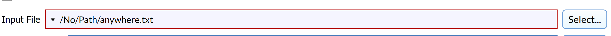

# InputFileFilterParameter

## Description

The **InputFileFilterParameter** allows the user to choose a file for input.


## Python Code Parts

In init:
```(lang-python)
self.input_file_param: str = ""
```

Setter method:
```(lang-python)
def _set_input_file(self, value: str) -> None:
		self.input_file_param = value
```
Getter method:
```(lang-python)
def _get_input_file(self) -> str:
		return self.input_file_param
```

In setup_parameters:
```(lang-python)
InputFileFilterParameter('Input File', 'input_file_param', self.input_file_param, FilterParameter.Category.Parameter, self._set_input_file, self._get_input_file, '*.file_type', 'File type', -1)
```

*'Input File'* = label that shows up for user in DREAM3D

*‘input_file_param’* = string value used to identify filter parameter in code

*self.input_file_param* = name of String variable for file name

*self._set_input_file* = setter method for String variable

*self._get_input_file* = getter method for String variable

*'\*\.file_type'* = file extension

*'File type'* = description of input file type

## Example Code and GUI
```(lang-python)
InputFileFilterParameter('Input File', 'input_file_param', self.input_file_param, FilterParameter.Category.Parameter, self._set_input_file, self._get_input_file, '*.ang', 'EDAX Ang', -1)
```

