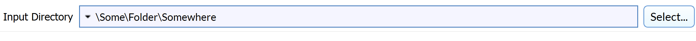

# InputPathFilterParameter

## Description

The **InputPathFilterParameter** allows the user to choose an input folder.


## Python Code Parts

In init:
```(lang-python)
self.input_path_param: str = ""
```

Setter method:
```(lang-python)
def _set_input_path_param(self, value: str) -> None:
		self.input_path_param = value
```
Getter method:
```(lang-python)
def _get_input_path_param(self) -> str:
		return self.input_path_param
```

In setup_parameters:
```(lang-python)
InputPathFilterParameter('Input Directory', 'input_path_param', self.input_path_param, FilterParameter.Category.Parameter, self._set_input_path_param, self._get_input_path_param, -1)
```

*'Input Directory'* = label that shows up for user in DREAM3D

*‘input_path_param’* = string value used to identify filter parameter in code

*self.input_path_param* = name of String variable for input path name

*self._set_input_path_param* = setter method for String variable

*self._get_input_path_param* = getter method for String variable

## Example Code and GUI
```(lang-python)
InputPathFilterParameter('Input Directory', 'input_path_param', self.input_path_param, FilterParameter.Category.Parameter, self._set_input_path_param, self._get_input_path_param, -1)
```

