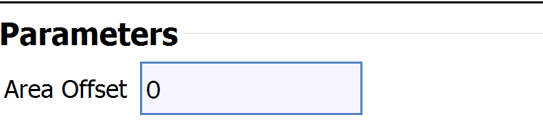

# IntFilterParameter

## Description

The **IntFilterParameter** allows the user to input an integer value.

## Python Code Parts

In init: `self.new_int: int = 0`

Setter method:
```
def _set_new_int(self, value: int) -> None:
	self.new_int = value
```
Getter method:
```
def _get_new_int(self) -> int:
	return self.new_int
```

In setup_parameters:` IntFilterParameter('Label Name', 'label_name', self.new_int, FilterParameter.Category.Parameter, self._set_new_int, self._get_new_int, -1)`

*‘Label Name’* = label that shows up for user in DREAM3D

*‘label_name’* = string value used to identify filter parameter in code

*self.new_int* = name of int variable used to keep track of user-inputted integer

*self._set_new_int* = setter method for int variable

*self._get_new_int* = getter method for int variable

## Example Code and GUI


`IntFilterParameter('Area Offset', 'area_offset', self.area_offset, FilterParameter.Category.Parameter, self._set_area_offset, self._get_area_offset, -1)`



