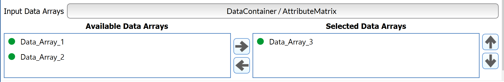

# MultiDataArraySelectionFilterParameter

## Description

The **MultiDataArraySelectionFilterParameter** allows the user to select DREAM3D data arrays from either the file explorer or from the pipeline.

## Requirement Type

```(lang-python)
MultiDataArraySelectionFilterParameter.RequirementType()
```
**Properties**

*amTypes* = type of AttributeMatrix required for array

*dcGeometryTypes* = type of Geometry required for array

*componentDimensions* = component dimensions required for the array

*daTypes* = data type(s) required for the array


## Python Code Parts

In init:
```(lang-python)
self.selected_data_array_paths: List[DataArrayPath] = []
```

Setter method:
```(lang-python)
def _set_selected_data_array_paths(self, value: List[DataArrayPath]) -> None:
    self.selected_data_array_paths = value
```
Getter method:
```(lang-python)
def _get_selected_data_array_paths(self) -> List[DataArrayPath]:
    return self.selected_data_array_paths
```

In setup_parameters:
```(lang-python)
req = MultiDataArraySelectionFilterParameter.RequirementType()
req.dcGeometryTypes = [IGeometry.Type.Image] #replace Image with type needed
req.amTypes = [AttributeMatrix.Type.Cell] #replace Cell with type needed
req.daTypes = ["float", "double", "int32_t"] #replace dtype names with dtypes needed
req.componentDimensions = [VectorSizeT([1])] #replace 1 with dimensions needed
MultiDataArraySelectionFilterParameter('Input Data Arrays', 'selected_data_array_paths', self.selected_data_array_paths, FilterParameter.Category.RequiredArray, self._set_selected_data_array_paths, self._get_selected_data_array_paths, req, -1)
```

*'Input Data Arrays’* = label that shows up for user in DREAM3D

*'selected_data_array_paths’* = string value used to identify filter parameter in code

*self.selected_data_array_paths* = list of DataArrayPath variables used to keep track of path for array

*self._set_selected_data_array_paths* = setter method for DataArrayPath list variable

*self._get_selected_data_array_paths* = getter method for DataArrayPath list variable

## Example Code and GUI
```(lang-python)
 MultiDataArraySelectionFilterParameter('Input Data Arrays', 'selected_data_array_path', self.selected_data_array_path, FilterParameter.Category.RequiredArray, self._set_selected_data_array_path, self._get_selected_data_array_path, MultiDataArraySelectionFilterParameter.RequirementType(), -1)
```

