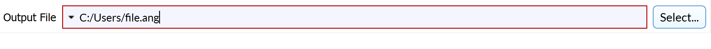

# OutputFileFilterParameter

## Description

The **OutputFileFilterParameter** allows the user to select an output file.

## Python Code Parts

In init:
```(lang-python)
self.output_file: str = ''
```

Setter method:
```(lang-python)
def _set_output_file(self, value: str) -> None:
	self.output_file = value
```
Getter method:
```(lang-python)
def _get_output_file(self) -> str:
	return self.output_file
```

In setup_parameters:
```(lang-python)
OutputFileFilterParameter('Output File', 'output_file', self.output_file, FilterParameter.Category.Parameter, self._set_output_file, self._get_output_file, '*.file_type', 'File Type', -1)
```

*‘Output File'* = label that shows up for user in DREAM3D

*'output_file'* = string value used to identify filter parameter in code

*self.output_file* = name of str variable used to keep track of user-inputted string

*self._set_output_file* = setter method for str variable

*self._get_output_file* = getter method for str variable

*'\*\.file_type'* = file extension

*'File type'* = description of output file type

## Example Code and GUI

```(lang-python)
OutputFileFilterParameter('Output File', 'output_file', self.output_file, FilterParameter.Category.Parameter, self._set_output_file, self._get_output_file, '*.ang', 'EDAX Ang', -1)
```



