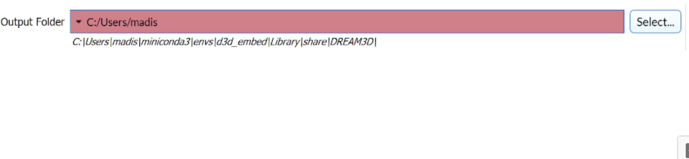

# OutputPathFilterParameter

## Description

The **OutputPathFilterParameter** allows the user to select an output folder.

## Python Code Parts

In init:
```(lang-python)
self.output_folder: str = 0
```

Setter method:
```(lang-python)
def _set_output_folder(self, value: str) -> None:
	self.output_folder = value
```
Getter method:
```(lang-python)
def _get_output_folder(self) -> str:
	return self.output_folder
```

In setup_parameters:
```(lang-python)
OutputPathFilterParameter('Output Folder', 'output_folder', self.output_folder, FilterParameter.Category.Parameter, self._set_output_folder, self._get_output_folder, -1)
```

*‘Output Folder’* = label that shows up for user in DREAM3D

*‘output_folder’* = string value used to identify filter parameter in code

*self.output_folder* = name of str variable used to keep track of user-inputted string

*self._set_output_folder* = setter method for str variable

*self._get_output_folder* = getter method for str variable

## Example Code and GUI

```(lang-python)
OutputPathFilterParameter('Output Folder', 'output_folder', self.output_folder, FilterParameter.Category.Parameter, self._set_output_folder, self._get_output_folder, -1)
```



