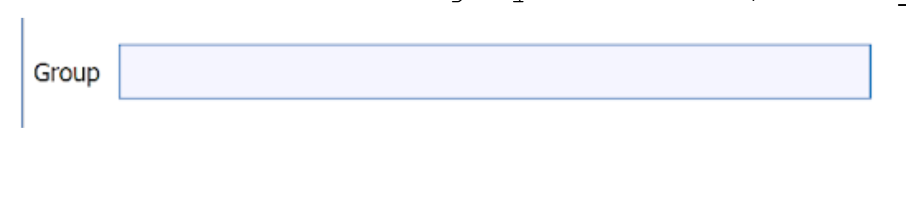

# StringFilterParameter

## Description

The **StringFilterParameter** allows the user to input a string.


## Python Code Parts

In init: `self.new_string: str = 0`

Setter method:
```
def _set_new_string(self, value: str) -> None:
	self.new_string = value
```
Getter method:
```
def _get_new_string(self) -> str:
	return self.new_string
```

In setup_parameters: `StringFilterParameter('Label Name', 'label_name', self.new_string, FilterParameter.Category.Parameter, self._set_new_string, self._get_new_string, -1)`

*‘Label Name’* = label that shows up for user in DREAM3D

*‘label_name’* = string value used to identify filter parameter in code

*self.new_string* = name of str variable used to keep track of user-inputted string

*self._set_new_string* = setter method for str variable

*self._get_new_string* = getter method for str variable

## Example Code and GUI

`StringFilterParameter('Group', 'group', self.group, FilterParameter.Category.Parameter, self._set_group, self._get_group, -1)`


